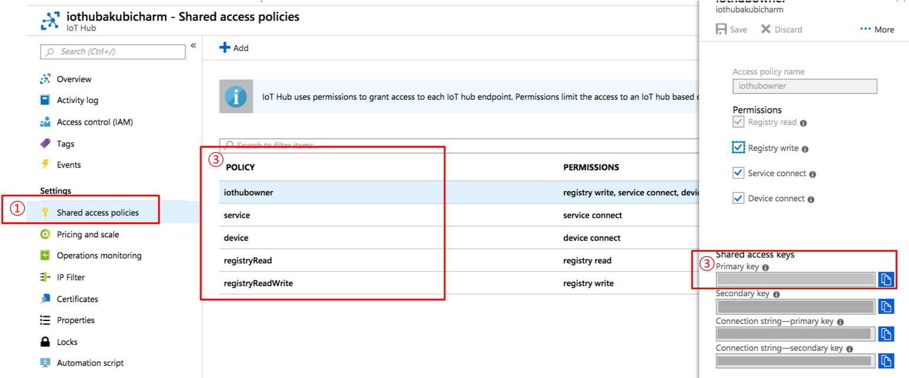
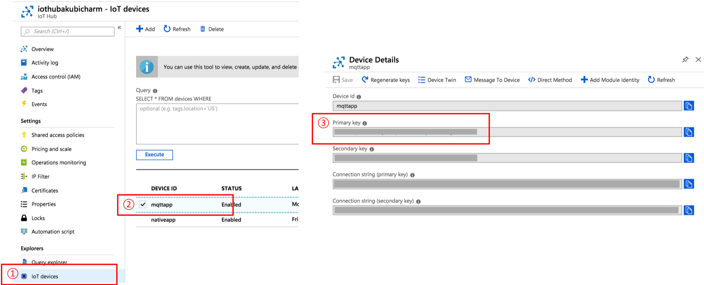

# サンプルプログラムについて

本サンプルプログラムは、paho mqtt ライブラリを利用したサンプルプログラムで、IoT Hubの公式ドキュメントに記載の方法を参考に実装しています。
詳細は参考ドキュメントに記載のURLを参照してください。

## MQTT の利用について
詳細は参考ドキュメント[1]を参照してください。

* 対応バージョン
 * 2018年9月現在のMQTTの対応バージョンは、MQTT v3.1.1です。
 * MQTT を利用する場合は、8883ポート
 * MQTT over webSocketを利用する場合は、ポート443

* ネットワークセキュリティ
 * TLS または SSL

* ペイロードのデータ形式
 * JSON

## Paho MQTT を利用した処理の流れ
1. SAS Tokenの生成
2. IoT Hubへの接続
3. メッセージの送受信

### SAS Token の生成
SAS Tokenの生成の詳細は、サンプルプログラムを参照してください。

SAS Token の生成方法は2種類あります。
1. IoT Hub共有アクセスキーの利用
2. IoT デバイスキーの利用

#### IoT Hub共有アクセスキーの取得
1. IoT Hubのメニューで「Shared access policies」を選択
2. ポリシーを選択
Device to Cloud メッセージの送信ならば「device」で可能
3. Shared access keysの「Primary Key」をコピー

IoT Hub共有アクセスキーを利用してSASトークンを生成する場合に利用するパラメータは次の通りです。

1. IoT Hub の URI
 * 例）IoT Hub名が sample の場合は、`sample.azure-devices.net`
2. IoT Hub共有アクセスキー
3. ポリシー

### IoTデバイスキーの取得
1. IoT Hubのメニューで「IoT devices」を選択
2. デバイス一覧から対象のデバイスを選択
3. 「Primary Key」をコピー

IoTデバイスキーを利用してSASトークンを生成する場合に利用するパラメータは次の通りです。
1. IoT HubのURI
 * 例）IoT Hub名が sample の場合は、`sample.azure-devices.net`
2. IoTデバイスキー

## 実行方法

### 実行環境とライブラリ
* Python 2.7.x
* paho-mqtt

### プログラムの編集
以下の文字列を、利用環境に合わせて編集してください。
* `<REPLACE YOUR IOT HUB NAME>` : 利用するIoT Hub URI
* `<REPLACE YOUR DEVICE ID>` : IoT Hub に登録したデバイスID
* `<REPLACE IOT HUB SHARED CONNECT KEY>` : IoT Hub 共有アクセスキー
* `<REPLACE YOUR DEVICE KEY>` : デバイスキー

### プログラムの実行
1. `send_mqtt.py` と `local_root_ca.cer` をダウンロードします。
2. 1の手順でダウンロードしたファイルが保存されているディレクトリに移動し、コンソールで `python send_mqtt.py` を実行します。

## 参考ドキュメント
[1] MQTTサポート
https://docs.microsoft.com/ja-jp/azure/iot-hub/iot-hub-mqtt-support

[2] IoT Hub へのアクセス制御
https://docs.microsoft.com/ja-jp/azure/iot-hub/iot-hub-devguide-security
