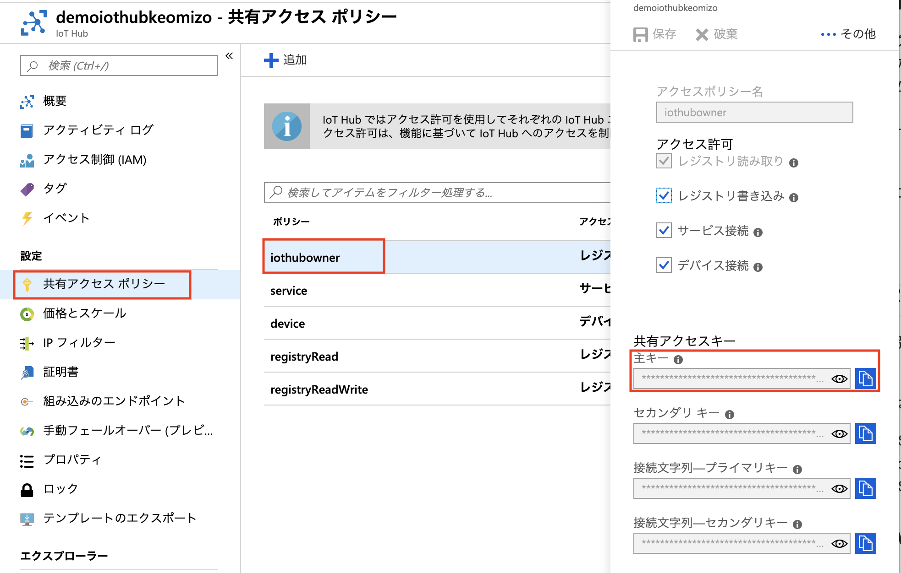

# Azure IoT HubのREST APIを利用したデバイスの登録

## REST APIの呼び出し
Azure IoT HubのREST API を呼び出すには、Authorization Key が必要です。
IoT Hubのサービスを呼び出す場合には、IoT Hubの共有アクセスポリシーのSASトークンを利用することが可能です。

https://docs.microsoft.com/ja-jp/azure/iot-hub/iot-hub-devguide-security


### SASトークンの生成
共有アクセスポリシーのSASトークンの生成は、共有アクセスキーを利用します。
SASトークンの生成は、Azure CLIの、Visual Studioのプラグイン、デバイスエクスプローラ、プログラムで生成が可能です。

* Azure CLI の利用
 * https://docs.microsoft.com/ja-jp/cli/azure/ext/azure-cli-iot-ext/iot/hub?view=azure-cli-latest#ext-azure-cli-iot-ext-az-iot-hub-generate-sas-token
* プログラムで生成
 * https://docs.microsoft.com/ja-jp/azure/iot-hub/iot-hub-devguide-security#security-token-structure


## 方法1）個別デバイスの登録

* 個別デバイス登録のREST API
 * https://docs.microsoft.com/ja-jp/rest/api/iothub/service/createorupdatedevice

ここでは、curl を使ってREST API を呼び出します。

1. SAS トークンの作成
2. Request Body の JSON の作成
3. REST の呼び出し


### 1. SAS トークンの作成
[Azureのマニュアル](https://docs.microsoft.com/ja-jp/azure/iot-hub/iot-hub-devguide-security#security-token-structure)　にあるサンプルコードを使って、SASトークンを作成します。

SASトークンの作成に必要な、共有アクセスポリシーとアクセスキーをAzure Portalで確認します。

(1) Azureポータル画面で、対象のIoT Hubを選択

(2) 左Paneで「共有アクセスポリシー」を選択

(3) 右Paneで「iothubowner」を選択

(4) ダイアログで共有アクセスキーの主キーのノートアイコンをクリックして、主キーをコピー



コピーした、共有アクセスポリシーの主キーを利用して SAS トークンを生成します。

``` python
def generate_sas_token(uri, key, policy_name, expiry=3600):
```

* uri : IoT HubのURI
* key : コピーした主キー
* policy_name: 共有アクセスポリシー名。ここでは `iothubowner`
* expiry : SASトークンの有効期限を秒単位で指定。3600秒=1時間

HTTPのヘッダーのキーワード`Authorization　:` に続いて生成したSASトークンを記載し、`auth.txt`というファイルに保存します。

auth.txt の例）
```
Authorization: SharedAccessSignature sr=demoiothub.azure-devices.net&skn=iothubowner&sig=9X%2B%2F7VeG0Yw0su00H0F%2FbVkCj00vqQKtgodt0GSU%2B4w%3D&se=1565333467
```

### 2. Request BodyのJSONの作成
Azure ポータルでデバイスを登録するときと同様に、認証方式とデバイス名をRequest Bodyで定義します。

JSONファイルの例
```
{
    "authentication": {
      "type": "sas"
    },
    "deviceid": "mydev02"
}
```

### 3. REST API の呼び出し
curl コマンドを使って、REST APIを呼び出します。

```
curl -X PUT \
  https://demoiothubhogehoge.azure-devices.net/devices/mydev01?api-version=2018-06-30 \
  -H '@auth.txt' \
  -H 'Content-Type: application/json' \
  -d '@createdevice.json'
```
